# Solução para Atualização dos Dados de Forma Resiliente e Estável 🚀

## Objetivo 🎯

Tornar o processo de atualização dos dados através das camadas (bronze, silver e gold) mais resilientes e estável, garantindo os SLAs necessários para o negócio, prevenindo a introdução de más práticas e erros em produção, sejam de implementação ou de configuração. Em caso de detecção de problemas, o desenvolvedor deve ser notificado e orientado sobre como proceder. 

## Tecnologias e Ferramentas 💻

- **Armazenamento:** [AWS S3](https://aws.amazon.com/pt/s3/)
- **Processamento:** [Databricks](https://www.databricks.com/br)
- **Análise:** [ThoughtSpot](https://www.thoughtspot.com/)
- **Orquestração:** [Airflow](https://airflow.apache.org/)
- **Versionamento e Pipeline CI/CD:** [GitLab](https://about.gitlab.com/)

## [Entregável 1] - Solução detalhada

### Etapas 📃

#### 1. Armazenamento

- Para prover escalabilidade e durabilidade dos dados, eles serão armazenados em camadas no AWS S3, conforme abaixo:

    - **Bronze:** Dados brutos na forma original.
    - **Silver:** Dados transformados.
    - **Gold:** Dados validados e prontos para análise e uso pelas unidades de negócio, utilizando o ThoughtSpot por exemplo.

- Os metadados dos dados (fonte, data, schema, etc.) poderão ser armazenados em um banco de dados NoSQL, como por exemplo o DynamoDB, facilitando a consulta, gerenciamento e governança;

- Para reduzir custos e otimizar o armazenamento, serão implementadas políticas de ciclo de vida dos dados, as quais irão permitir automatizar a transição dos dados entre diferentes classes de armazenamento do S3 com base nos padrões de acesso;

    -  Por exemplo, os dados que não forem acessados após um determinado período de tempo serão movidos para a classe de armazenamento S3 Infrequent Access (S3 IA) ou até mesmo para a S3 Glacier Flexible Retrieval.

#### 2. Processamento

- O Databricks será utilizado como plataforma de processamento de dados em nuvem, que além de prover recursos de clusterização, também irá oferecer provisionamento automático para lidar com grandes volumes de dados para executar as tarefas de ETL (extração, transformação e carregamento), limpeza e preparação dos dados, o que significa que recursos poderão ser dimensionados de acordo com a demanda, reduzindo significativamente os custos operacionais;

    - Por exemplo, poderá ser provisionado clusters temporários para execução de tarefas apenas quando necessário, evitando gastos excessivos com infraestrutura ociosa;

- Cada notebook será executado em um cluster Databricks dedicado, conforme as boas práticas recomendam, aproveitando a escalabilidade e o poder de processamento da plataforma de forma eficiente, garantindo que apenas os recursos necessários sejam utilizados;

    - Por exemplo, poderá ser configurado políticas de auto escalonamento para ajustar dinamicamente o tamanho dos clusters com base na carga de trabalho, evitando desperdício de recursos e consequentemente reduzindo os custos.

#### 3. Análise

- O ThoughtSpot será utilizado como plataforma de análise de dados self-service, fornecendo aos usuários de negócio acesso interativo e visual aos dados da camada gold;

- Os usuários poderão explorar os dados, criar dashboards e relatórios personalizados, sem a necessidade de conhecimento técnico aprofundado.

#### 4. Orquestração

- O Airflow será utilizado para agendar, monitorar e gerenciar os pipelines de dados;

- Políticas de escalonamento dinâmico de recursos serão configuradas para aumentar ou diminuir o número de workers do Airflow com base na carga de trabalho, otimizando os recursos de computação, reduzindo significamente os custos;

- Será implementado scripts e ferramentas que desligam automaticamente instâncias do Airflow quando não estiverem em uso por um determinado período de tempo;

- Alertas serão configurados e poderão ser enviados no Slack, notificando o desenvolvedor sobre as métricas de desempenho dos pipelines (tempo de execução, volume de dados processados, taxa de erros, etc) e sobre o status de execução das etapas dos pipelines, incluindo falhas;

- Todos os logs serão armazenados no S3 para fins análise e investigação, possibilitando a identificação de oportunidades de otimização e ajustes nas configurações para reduzir custos sem comprometer a disponibilidade.

#### 5. Versionamento e Pipeline CI/CD

- O GitLab será utilizado como repositório para gerenciamento, controle de versão e documentação dos scripts, integração contínua, entrega contínua e colaboração entre equipes de desenvolvimento;

- Será configurado um pipeline que irá executar testes automatizados, como testes unitários e testes de integração, sempre que houver uma nova alteração no código do repositório;

- Haverá a implementação de um processo de revisão de código, onde os membros da equipe revisam e validam as alterações propostas antes de serem integradas ao pipeline principal;

- Ferramentas de linting e verificadores de estilo de código serão utilizadas para garantir que o código do pipeline siga as melhores práticas e os padrões estabelecidos;

- Ferramentas de análise estática de código serão configuradas para identificar potenciais problemas de qualidade, como código duplicado, complexidade excessiva e vulnerabilidades de segurança.

#### 6. Governança de Dados

- Um catálogo de dados será implementado para documentar as fontes de dados, pipelines, tabelas e outros artefatos relacionados à gestão de dados;

- Políticas de acesso, qualidade e segurança serão definidas e aplicadas para restringir e controlar o acesso aos dados, garantindo a confiabilidade, confidencialidade e integridade dos dados.

### Trade-offs 🔄

- **Custo:** A utilização de ferramentas como Databricks e ThoughtSpot poderão gerar custos adicionais. No entanto, o retorno do investimento (ROI) da solução poderá ser significativo em termos de maior eficiência, produtividade e redução de riscos.

- **Escalabilidade e Elasticidade:** A configuração correta dos recursos de escalabilidade e elasticidade pode ser complexa. No entanto, uma vez configurados adequadamente, esses recursos permitem que os pipelines de dados se adaptem dinamicamente à demanda, garantindo um desempenho consistente mesmo diante de variações na carga de trabalho.

- **Serviços Gerenciados:** A solução depende da disponibilidade e desempenho de serviços gerenciados como AWS S3, Databricks e ThoughtSpot. No entanto, permitirá que a equipe se concentre nas tarefas de valor agregado, aproveitando a expertise e a infraestrutura desses provedores, o que pode resultar em uma implementação mais rápida e eficiente dos pipelines de dados.

- **Complexidade:** A implementação da solução completa poderá exigir um investimento inicial em treinamento e familiarização das equipes com as novas ferramentas. No entanto, a longo prazo, a solução irá contribuir para a padronização dos processos, reduzindo o tempo de desenvolvimento e a necessidade de manutenção dos pipelines.

### Benefícios 🎁

- **Armazenamento centralizado e seguro de dados:** O S3 garante que seus dados estejam sempre disponíveis e protegidos.

- **Eficiência operacional:** O Databricks permite lidar com grandes volumes de dados de forma eficiente e escalável, otimizando recursos e reduzindo custos operacionais.

- **Análise de dados self-service:** O ThoughtSpot capacita os usuários de negócios a explorar e analisar dados sem a necessidade de conhecimento técnico aprofundado.

- **Automação e orquestração:** O Airflow garante que o pipeline de dados seja executado de forma confiável e consistente, garantindo os SLAs necessários para o negócio.

- **Controle de versão e qualidade do código:** Além do GitLab realizar o controle de versão e documentação dos scripts, garantindo a colaboração entre equipes de desenvolvimento, também implementa pipelines CI/CD automatizados, que juntamente com testes automatizados e de revisão de código, assegura a qualidade do código e a integridade dos pipelines.

## [Entregável 2] - Implementação prática de um componente demonstrando o funcionamento

O componente da solução implementado para demonstrar o funcionamento foi a criação e execução de uma tarefa, utilizando o Amazon Managed Workflows for Apache **Airflow**, tornando o processo de atualização dos dados através das camadas mais resilientes e estável.

> **Nota**
> Esta implementação trata-se de um MVP (produto viável mínimo) com o objetivo de demonstrar o funcionamento de um componente específico da solução citada anteriormente.

### Estrutura do Bucket no S3 📁

```sql
├── data-engineering-solution-mvp
│   ├── airflow
│   │   ├── dags
│   │   │   ├── people_pipeline.py
│   │   ├── scripts
│   │   │   ├── requirements.txt
│   ├── data
│   │   ├── bronze
│   │   │   ├── people-100000.csv
│   │   │   ├── people-100000_v2.csv
│   │   ├── silver
│   │   │   ├── people_all.parquet
│   │   ├── gold
│   │   │   ├── people_without_duplicates.parquet
```

#### Dados

- Os dados da camada bronze são fictícios, oriundos do repositório do [Github](https://github.com/datablist/sample-csv-files?tab=readme-ov-file);

    - O download pode ser realizado [aqui](https://drive.google.com/uc?id=1VEi-dnEh4RbBKa97fyl_Eenkvu2NC6ki&export=download);

    - Os dados dos arquivos "people-100000.csv" e "people-100000_v2.csv" foram duplicados propositalmente para demonstrar a validação realizada na etapa "write_gold_data" da tarefa "people_pipeline", mencionada abaixo.

### Tarefa (DAG) 🚥

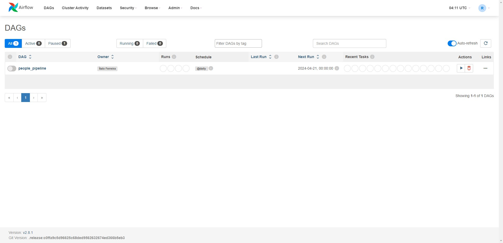

### Fluxo 🔀

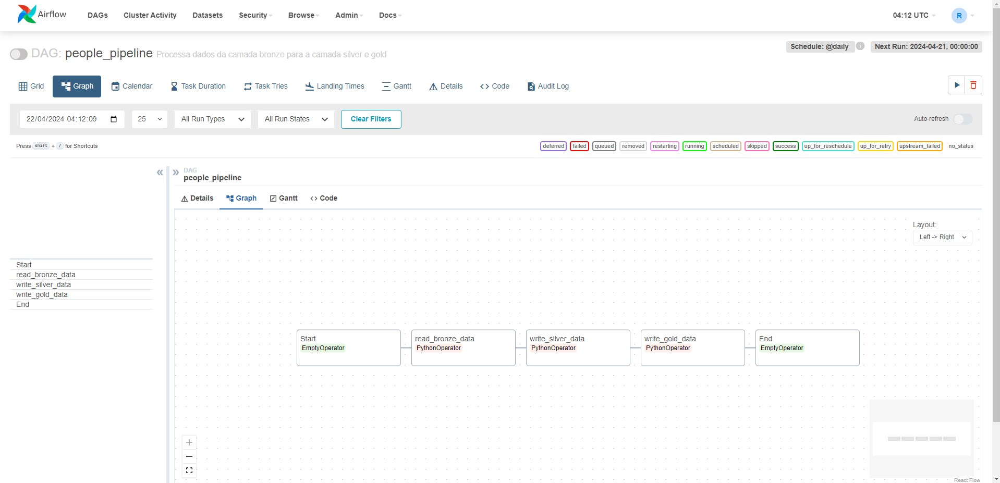

#### 1. Etapa "read_bronze_data"

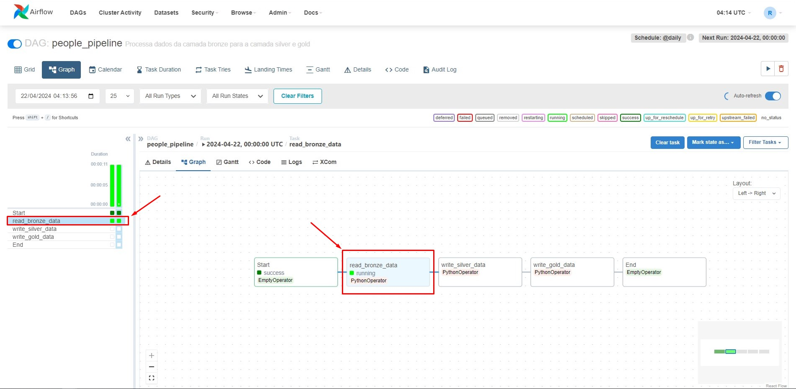

- Esta etapa é responsável por capturar os dados brutos na forma original de todos os arquivos armazenados na camada bronze;

    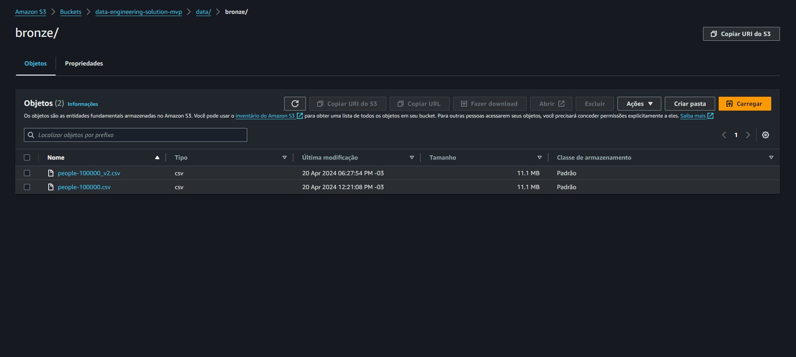

    - A origem dos dados (bucket S3) é configurada como uma variável no Airflow, portanto não é necessário alterar o script python do pipeline, facilitando a utilização por profissionais com baixo conhecimento técnico e possibilitando a reutilização do código em outros pipelines de dados;

        

- A leitura dos arquivos é realizada de forma dinâmica, independentemente da quantidade de arquivos existente e da nomenclatura deles;

- Ao final desta etapa uma notificação é enviada ao Slack sinalizando êxito (quantidade de arquivos processados) ou falha, com os respectivos detalhes.

    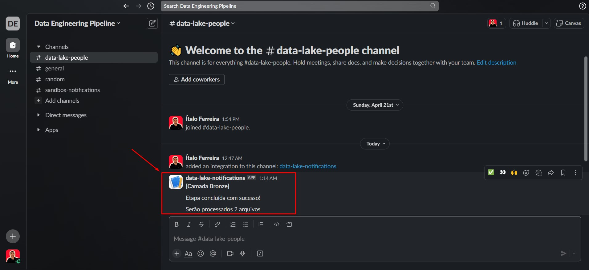

#### 2. Etapa "write_silver_data"

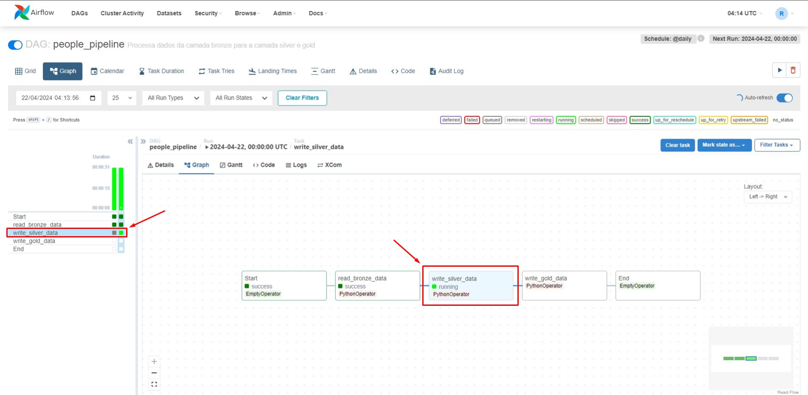

- Esta etapa é responsável por capturar os dados processados na etapa anterior, consolidar e salvar em formato parquet na camada silver;

    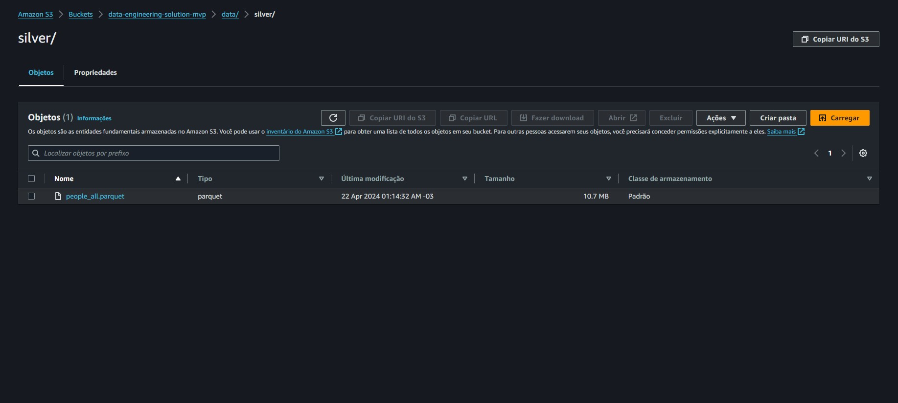

    - O nome do arquivo gerado é configurado como uma variável no Airflow, portanto não é necessário alterar o script python do pipeline, facilitando a utilização por profissionais com baixo conhecimento técnico e possibilitando a reutilização do código em outros pipelines de dados;

        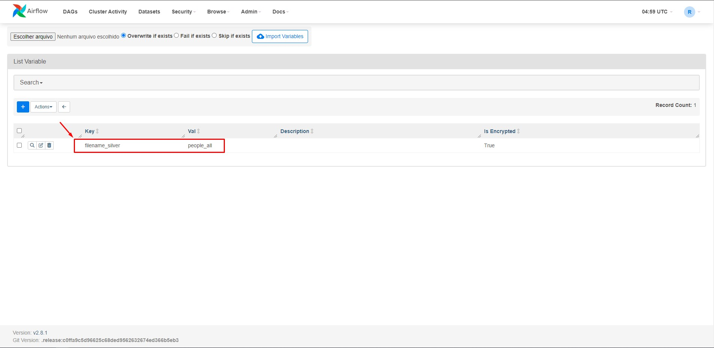

- Ao final desta etapa uma notificação é enviada ao Slack sinalizando êxito (nome do arquivo gerado) ou falha, com os respectivos detalhes.

    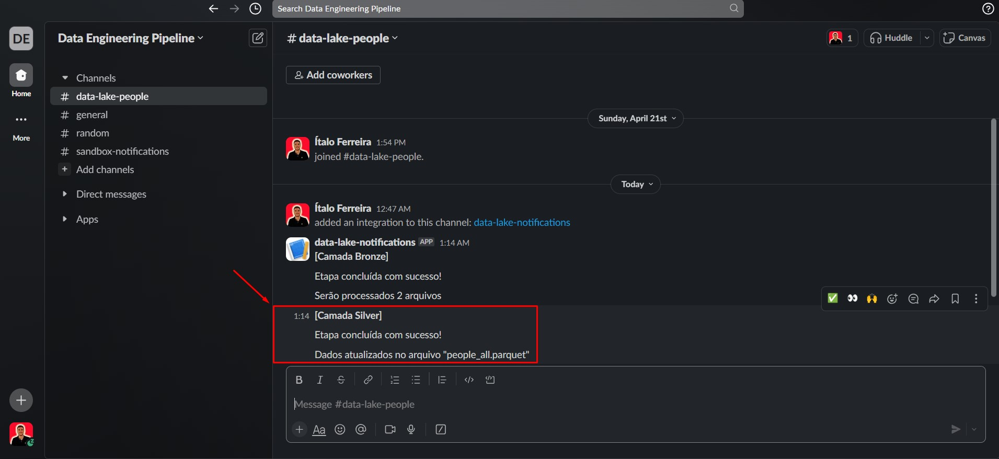

#### 3. Etapa "write_gold_data"

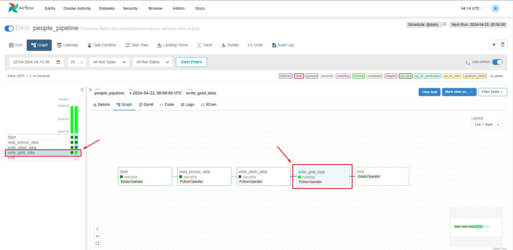

- Esta etapa é responsável por capturar os dados processados na etapa anterior, retirar as duplicidades de registros e salva-los em formato parquet na camada gold para ser consumido pelas áreas de negócio;
    
    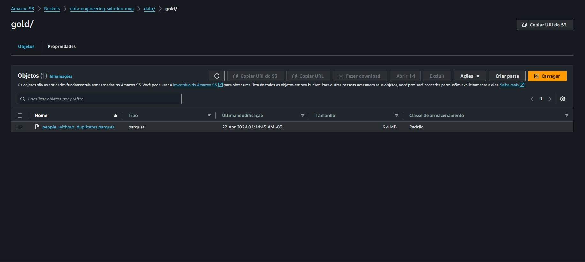

    - O nome do arquivo gerado é configurado como uma variável no Airflow, portanto não é necessário alterar o script python do pipeline, facilitando a utilização por profissionais com baixo conhecimento técnico e possibilitando a reutilização do código em outros pipelines de dados;

        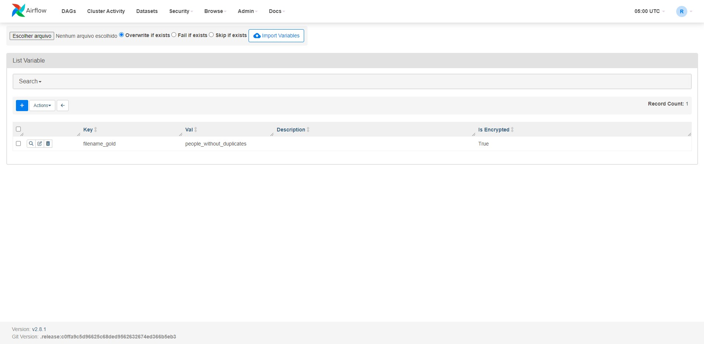

- Ao final desta etapa uma notificação é enviada ao Slack sinalizando êxito (nome do arquivo gerado e quantidade de registros duplicados identificado) ou falha, com os respectivos detalhes.
    
    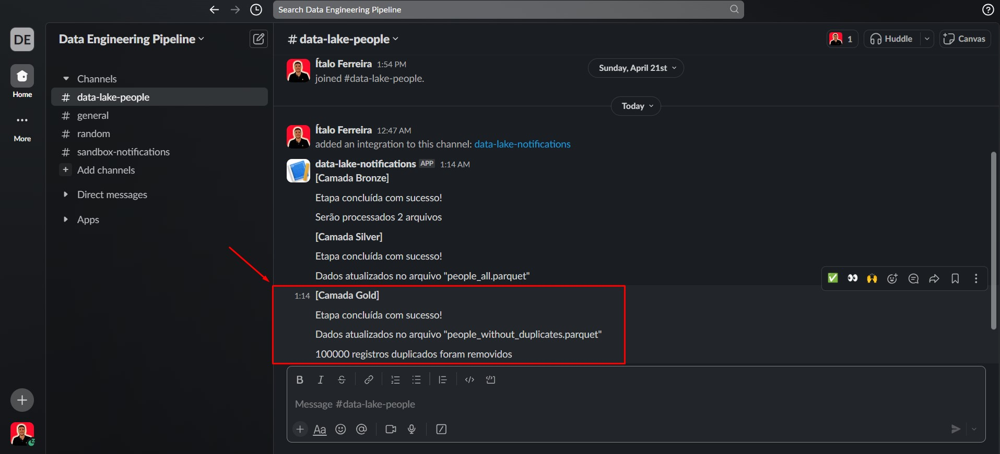

#### 4. Execução completa do fluxo

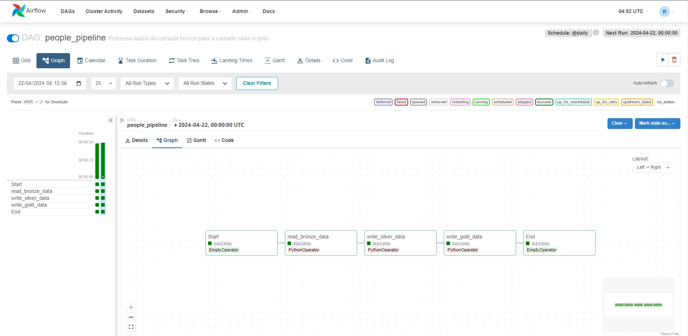

### Como Executar

#### 1. Crie um bucket no S3 conforme a estrutura abaixo

```sql
├── <nome-do-seu-bucket>
│   ├── airflow
│   │   ├── dags
│   │   │   ├── people_pipeline.py
│   │   ├── scripts
│   │   │   ├── requirements.txt
│   ├── data
│   │   ├── bronze
│   │   │   ├── people-100000.csv
│   │   │   ├── people-100000_v2.csv
│   │   ├── silver
│   │   ├── gold
```

> **Nota**
> Os arquivos "people_pipeline.py" e "requirements.txt" estão disponibilizados neste repositório e o download dos arquivos "people-100000.csv" e "people-100000_v2.csv" pode ser realizado [aqui](https://drive.google.com/uc?id=1VEi-dnEh4RbBKa97fyl_Eenkvu2NC6ki&export=download).

#### 2. Crie um ambiente no Amazon Managed Workflows for Apache Airflow

- Nas configurações do ambiente da seção "Código do DAG no Amazon S3":
    - Em "Bucket do S3", selecione o bucket criado no passo anterior;
    - Em "Pasta DAGs", selecione a pasta "dags" que está dentro do bucket criado no passo anterior;
    - Em "Arquivo de requisitos - opcional", selecione o arquivo "requirements.txt" que está dentro da pasta "scripts" criado dentro do bucket no passo anterior.
    
- Nas configurações do ambiente da seção "Rede":
    - Em "Grupos de segurança", crie um novo grupo de segurança com as permissões necessárias para acessar a interface do usuário do Airflow;
        - Caso queira acessar a interface do usuário fora da rede corporativa, em "Acesso ao servidor web" selecione "Rede pública (Acesso à Internet). Lembrando que está opção deixará o seu ambiente exposto publicamente.

> **Nota**
> Após criar o ambiente do Airflow, será necessário acessar o IAM para conceder permissão na função do Amazon Managed Workflows for Apache Airflow de leitura (getObjects) e escrita (putObjects) ao bucket S3 criado no passo 1.

#### 3. Acesse a interface do usuário do Airflow para configurar as variáveis e a conexão com o Slack para o envio das notificações

- Configuração de variáveis    

    - No menu superior da interface do usuário do Airflow, acesse "Admin -> Variables" e crie as variáveis abaixo:

        - `s3_bucket`: Nome do seu bucket S3.Sua chave de API para acessar o serviço.
        - `filename_silver`: Nome do arquivo que será gerado na camada silver.
        - `filename_gold`: Nome do arquivo que será gerado na camada gold.

            - Exemplo:

                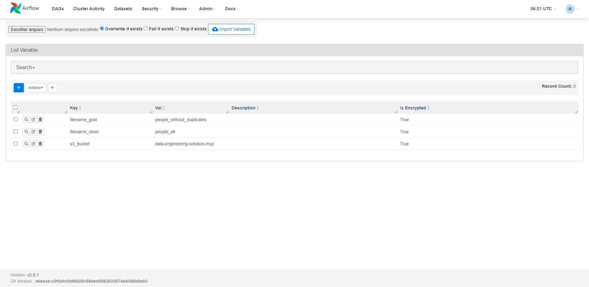

- Configuração de conexão com o Slack    
    - No menu superior da interface do usuário do Airflow, acesse "Admin -> Connections" e crie a conexão abaixo:

        - `slack_webhook_connection`: Webhook URL criada referente ao canal do Slack.

            - Exemplo:

                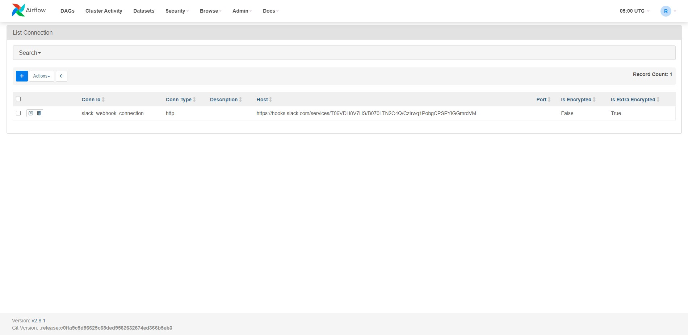

    > **Nota**
    > Será necessário acessar as configurações do Slack para ativar os webhooks de entrada e adicionar um novo webhook ao espaço de trabalho vinculado ao canal desejado. Você pode conferir o passo a passo na [documentação](https://api.slack.com/messaging/webhooks) do Slack.

#### 4. Execute a tarefa (DAG)

- Acesse a interface do usuário do Airflow;
- No menu superior da interface do usuário do Airflow, acesse "DAGs";
- A tarefa "people_pipeline" será importada e aparecerá na interface do usuário do Airflow;
- Na tarefa, dentro da seção "Actions", clique no botão "Trigger DAG" para executá-la, conforme print abaixo.
    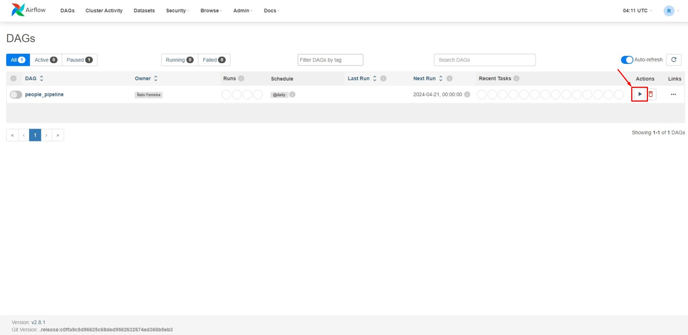

#### 5. Valide a execução da tarefa e se os dados foram gerados/atualizados nas respectivas camadas

- Verifique as notificações que chegaram no canal do slack configurado no passo 3;
- Caso tenha recebido notificações de êxito, verifique se os dados foram gerados/atualizados nas camadas silver e gold dentro da pasta "data" criada no bucket no passo 1:
    - Verifique a existência do arquivo .parquet na camada silver;
    - Verifique a existência do arquivo .parquet na camada gold.

## Desenvolvido por ✨

- [Ítalo César Ferreira da Costa](https://www.olatiferreira.com)